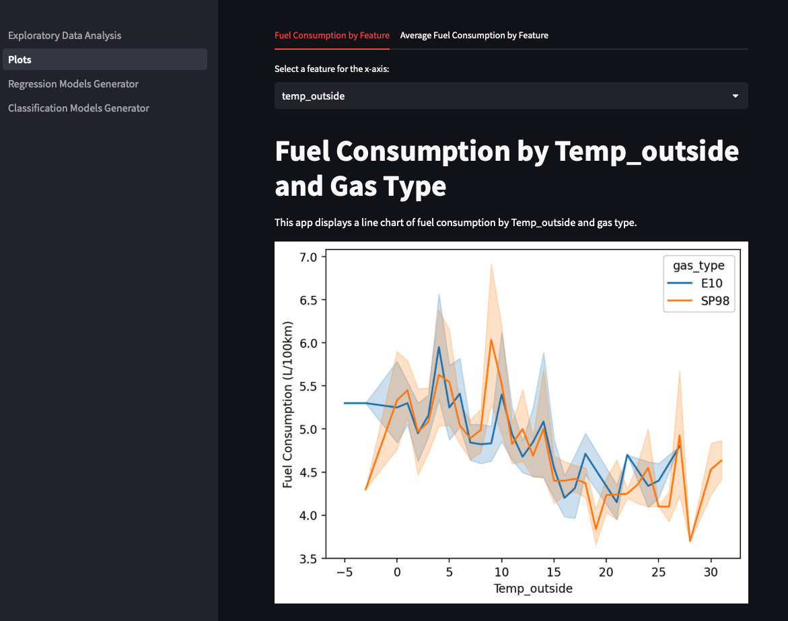

# Fuel Consumption Comparison with Streamlit

This project compares the consumption of two fuels (E10 and SP98) based on various parameters, such as distance, speed, temperature, weather, and whether or not the AC is on. The project includes a Jupyter notebook for data cleaning and preparation, as well as a Streamlit application for displaying the results and comparing algorithms for regression and classification models.

You can see a running instance [here](https://gas-eda-fabio1623.streamlit.app).

Please note that it is deployed on **Streamlit Cloud** so the application could go in **sleep mode** and need some time to reload.

## Usage

To run the Streamlit application, from the root directory run the Exploratory_Data_Analysis.py file using the following command:

`streamlit run Exploratory_Data_Analysis.py`

## Project Structure

The project is organized as follows:

- content: This directory contains application image.
- data: This directory contains the raw and cleaned data used in the project.
- models: This directory contains the generated classification and regression models.
- pages: This directory contains the Streamlit pages.